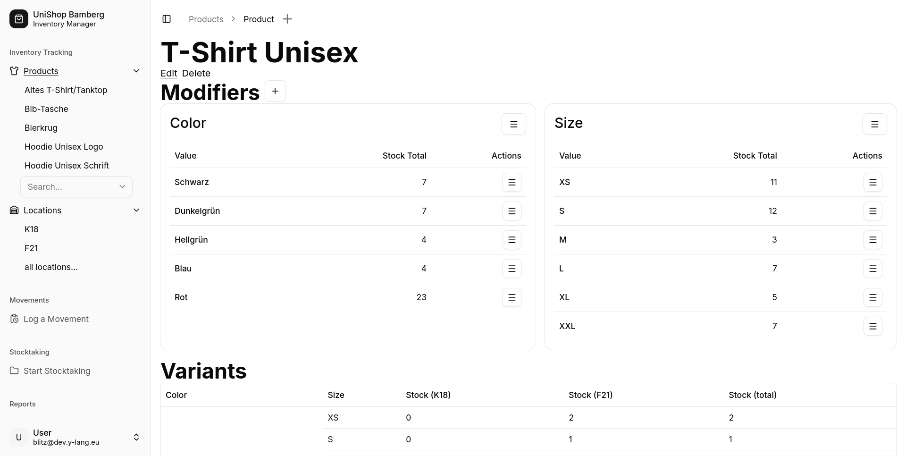
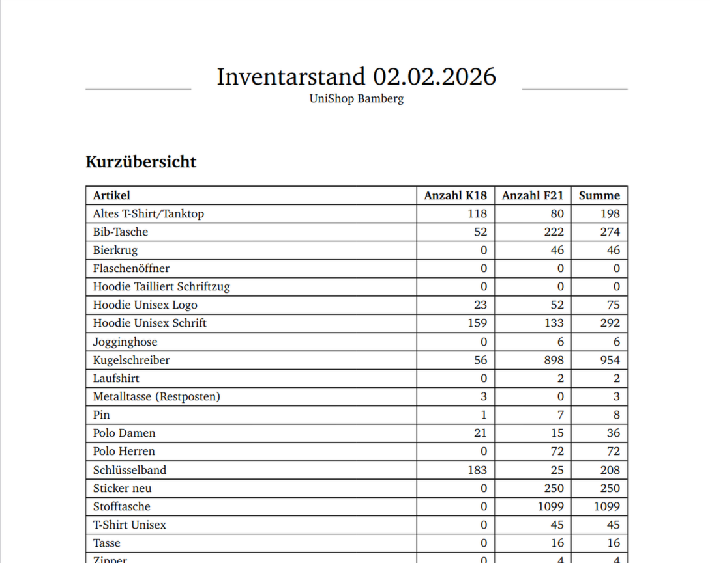
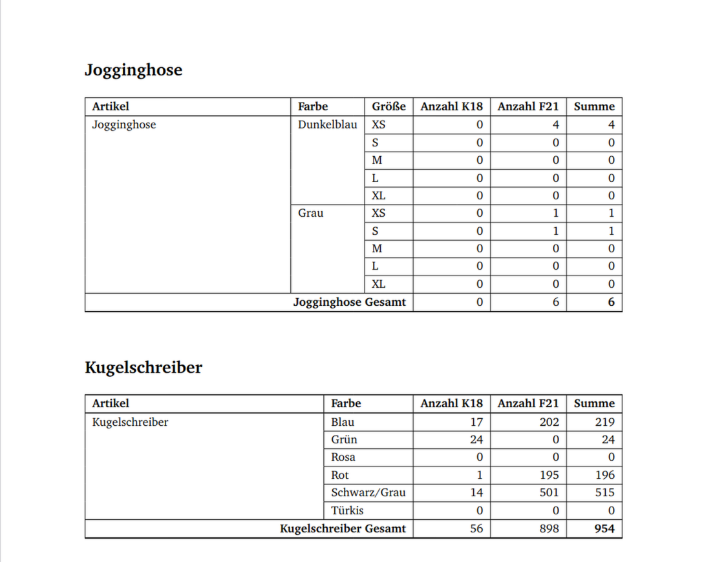

<div align="center">
  <h3 align="center">UniShop Inventory</h3>

  <p align="center">
    Inventory Management for the merchandising shop at University Bamberg
  </p>
</div>

## About The Project



> Inventory management for Unishop Bamberg (Next.js + shadcn + Prisma + PostgreSQL)

A lightweight inventory system used by the official Unishop at the University of Bamberg to manage products, variants, locations, stock movements and stock-taking audits. Built with Blitz.js / Next.js, Prisma (PostgreSQL) and shadcn UI components.

## Built With

* [](#)
* [](#)
* [](#)
* [](#)
* [](#)

## Prerequisites

- Node.js 20+ (recommended) + yarn
- Docker & Docker Compose (optional, recommended for local DB)

## Environment

This project expects a `.env.local` file (or other env file) with at least:

```env
DATABASE_URL="postgresql://<user>:<password>@localhost:5432/<db>?schema=public"
```

When using the included `docker-compose.yml`, the DB runs on Postgres 18-alpine and reads env values from `.env.local`.


## Example Report

[Example Report (PDF)](docs/report-example.pdf)




